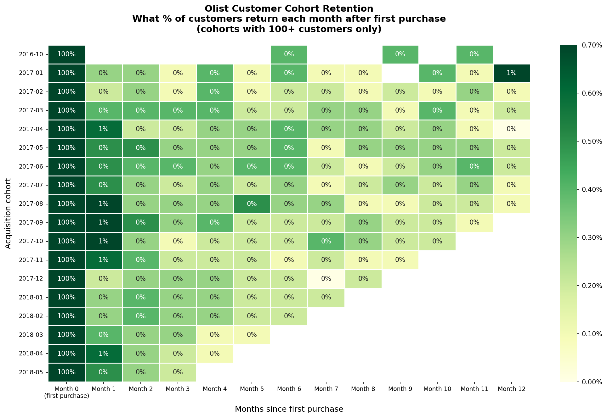
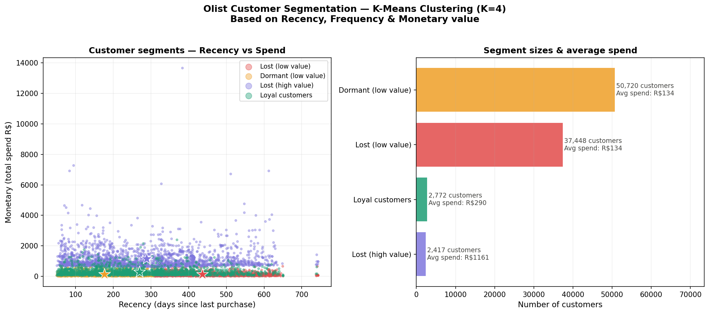
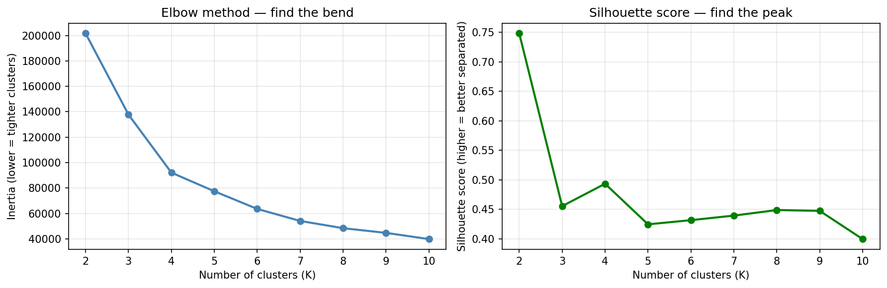

# Olist E-Commerce Customer Analytics

End-to-end data analytics project on 100,000+ real Brazilian e-commerce orders.
Built with SQL, Python, and machine learning to extract actionable business insights.

## Key findings

- 97% of customers never return — but repeat buyers are worth 3× more (R$160 vs R$506 LTV)
- 0.47% average Month-1 retention across 17 cohorts
- 2,417 high-value churned customers found via K-Means (avg spend R$1,161) — invisible without ML
- Black Friday spike of +53.6% revenue in November 2017
- Beauty & health is the #1 revenue category; computers highest ticket at R$1,099 avg

## Business recommendations

1. Post-purchase email at day 14 targeting beauty, pet and household buyers
2. Re-engagement campaign for 2,417 high-value churned customers — R$1,161 avg spend justifies significant budget
3. Pre-build inventory in October to capture early Black Friday demand

## Tech stack

- **DuckDB** — in-memory analytical database, star schema design
- **Python / pandas** — data cleaning, cohort analysis, RFM scoring
- **scikit-learn** — K-Means clustering, StandardScaler
- **seaborn / matplotlib** — cohort heatmap, segmentation charts
- **Git / GitHub** — version control

## Visuals

### Cohort retention heatmap

### Customer segmentation — K-Means (K=4)

### Elbow method — choosing optimal K

## Data source

[Olist Brazilian E-Commerce Dataset](https://www.kaggle.com/datasets/olistbr/brazilian-ecommerce)
100k orders, 9 CSV files, real anonymised data from 2016–2018.

## How to run

    # 1. Clone the repo
    git clone https://github.com/NARO136/olist-analytics.git

    # 2. Install dependencies
    pip install duckdb pandas numpy scikit-learn seaborn matplotlib

    # 3. Download dataset from Kaggle and place CSVs in data/raw/

    # 4. Run notebooks in order:
    #    01_exploration → 02_cohort_analysis → 03_customer_segmentation

## Author

Emanuel Jurjonescu — [LinkedIn](https://linkedin.com/in/emanuel-jurjonescu-8a8037350/) | [GitHub](https://github.com/Emanuel384)
